### Why ML Strategy

"The problem is that if you choose poorly, it is entirely possible that you end up spending six months charging in some direction only to realize after six months that it didn't do any good. For example, I've seen some teams spend literally six months collecting more data only to realize after six months that it barely improved the performance of their system."

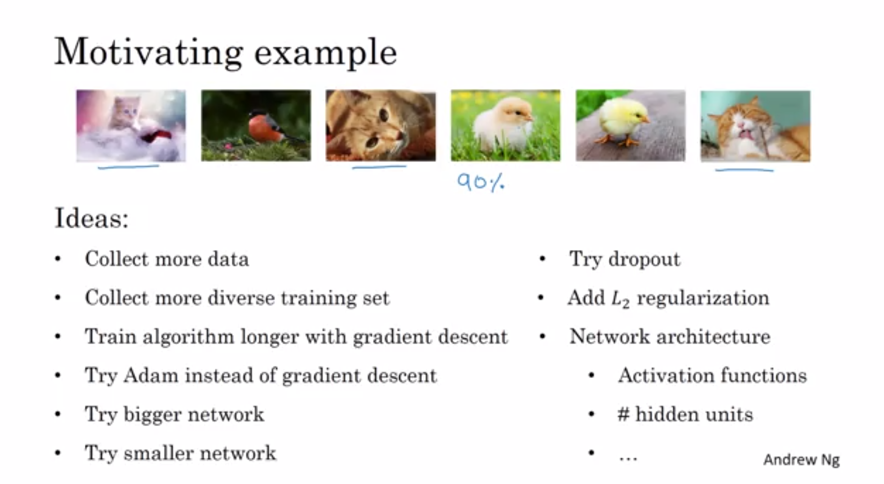

### Orthogonalization

Being clear-eyed about what to tune in order to try to achieve one effect. 

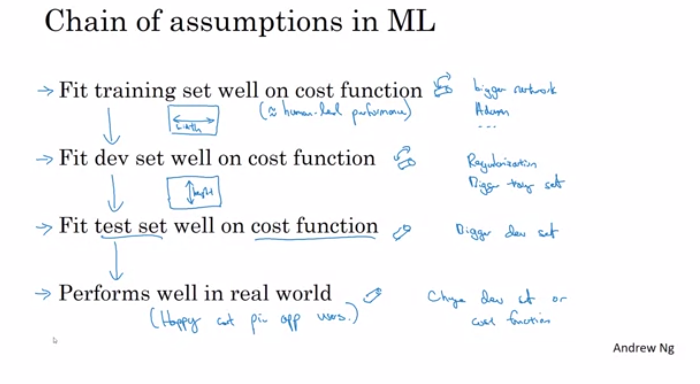

### Using a single real number evaluation metric

Rather than using two numbers, precision and recall, to pick a classifier, you just have to find a new evaluation metric that combines precision and recall.
In the machine learning literature, the standard way to combine precision and recall is something called an F1 score. Less formally, you can think of this as some way that averages precision and recall.

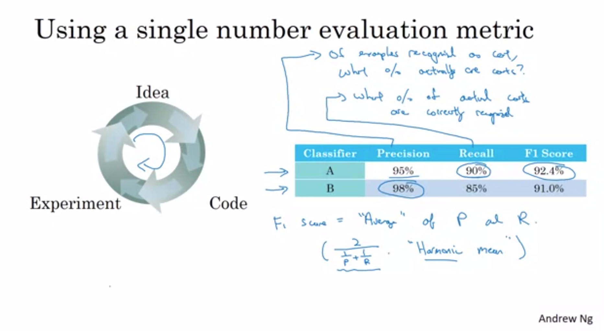

### Satisficing and optimizing metric

If there are multiple things you care about, choose one as the optimizing metric that you want to do as well as possible on, and one or more as satisficing metrics where you'll be satisfised when it does better than some threshold. In the image below, calculating the "cost" using an artificial equation like that and using it as the evaluation metric is not the wise thing to do.

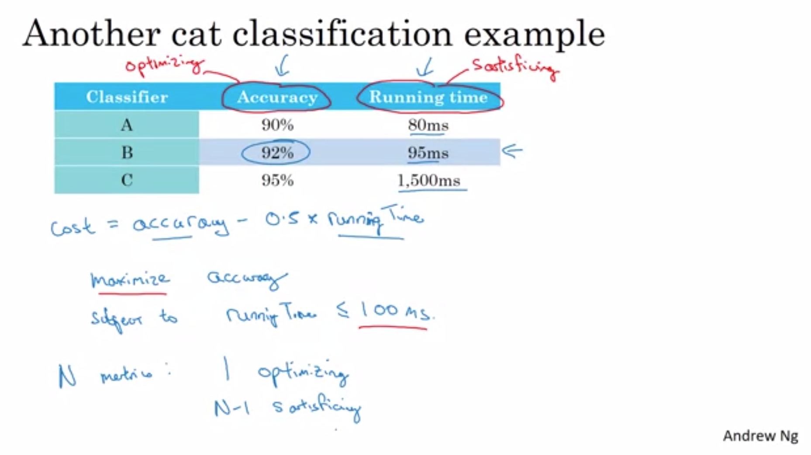

### Train/dev/test distributions

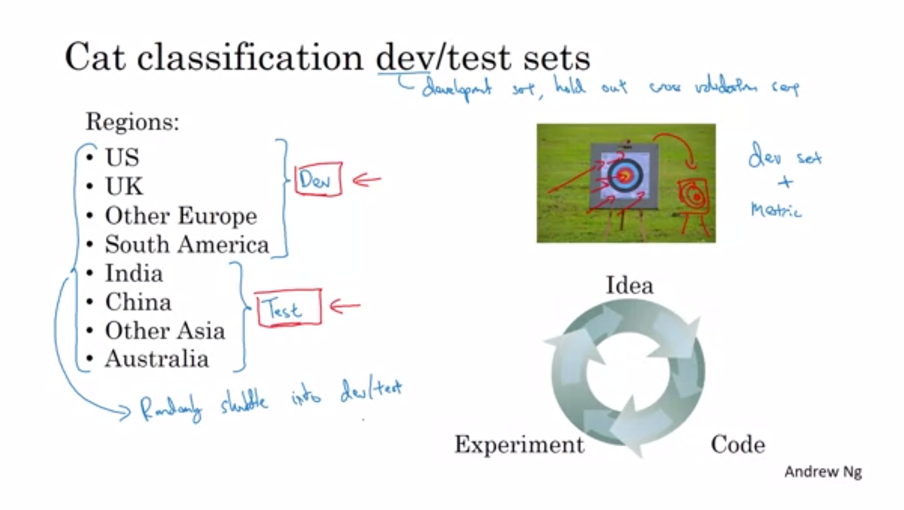

Setting up your dev set, plus, your single real number evaluation metric, that's like placing a target and telling your team where you think is the bull's eye you want to aim at.  
Machine learning teams are often very good at shooting different arrows into targets and innovating to get closer and closer to hitting the bullseye, doing well on your metric on your dev sets. And, the problem with how we've set up the dev and test sets in the example above is that, your team might spend months innovating to do well on the dev set only to realize that, when you finally go to test them on the test set, data from these four regions at the bottom, might be very different than the regions in your dev set. So, you might have a nasty surprise and realize that, all the months of work you spent optimizing to the dev set, is not giving you good performance on the test set. So the genral guideline would be this:

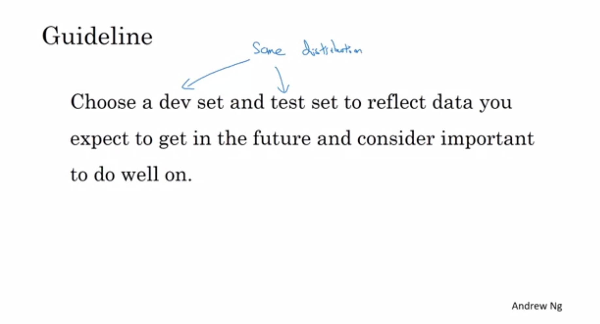

### Size of the dev and test sets:

"In the era of big data, I think the old rule of thumb of a 70/30 no longer applies. And the trend has been to use more data for training and less for dev and test, especially when you have a very large data sets."

### When to change dev/test sets and metrics: 

If doing well on your metric and your current dev sets or dev and test sets' distribution does not correspond to doing well on the application you actually care about, then change your metric and your dev test set.

### Avoidable bias

Keep improving your training performance until you get down to Bayes error but you don't actually want to do better than Bayes error. You can't actually do better than Bayes error unless you're overfitting.

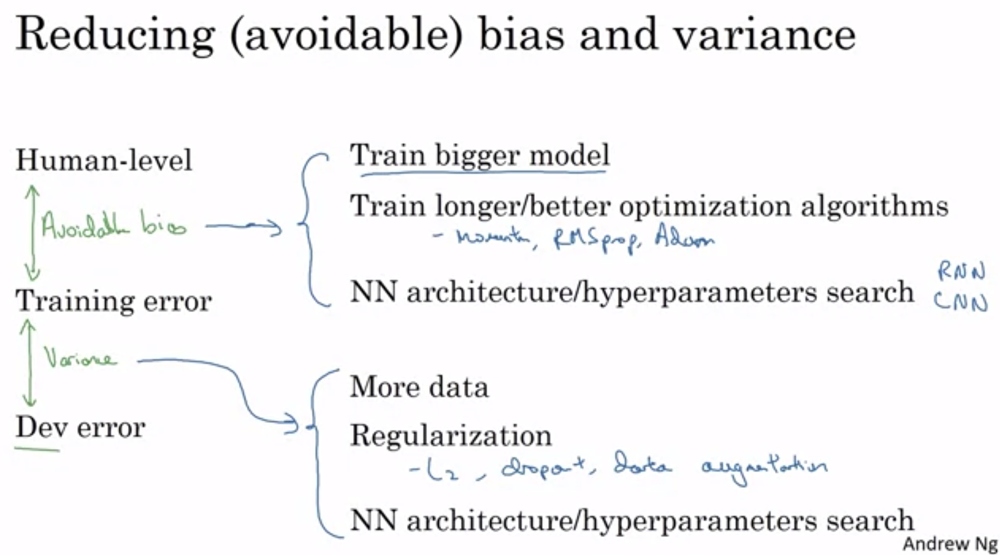

### Error Analysis:

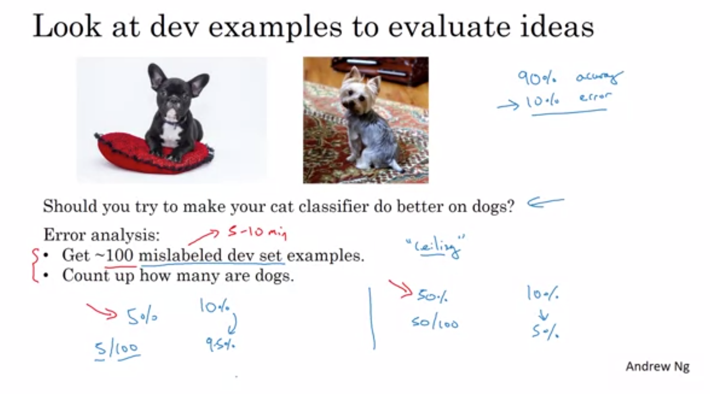

The conclusion of this process gives you an estimate of how worthwhile it might be to work on each of these different categories of errors.

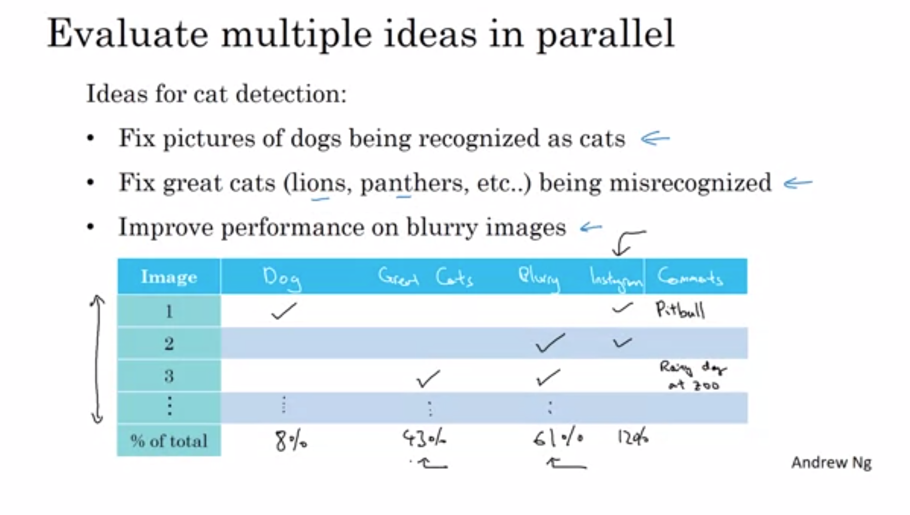

### Cleaning up incorrectly labeled data

"Three numbers I recommend you look at to try to decide if it's worth going in and reducing the number of mislabeled examples are the following:
- overall dev set error
- errors due to incorrect labels
- errors due to other causes  

When I'm leading a machine learning team and I want to understand what mistakes it is making, I would actually go in and look at the data myself and try to counter the fraction of errors. And I think that because these minutes or maybe a small number of hours of counting data can really help you prioritize where to go next."

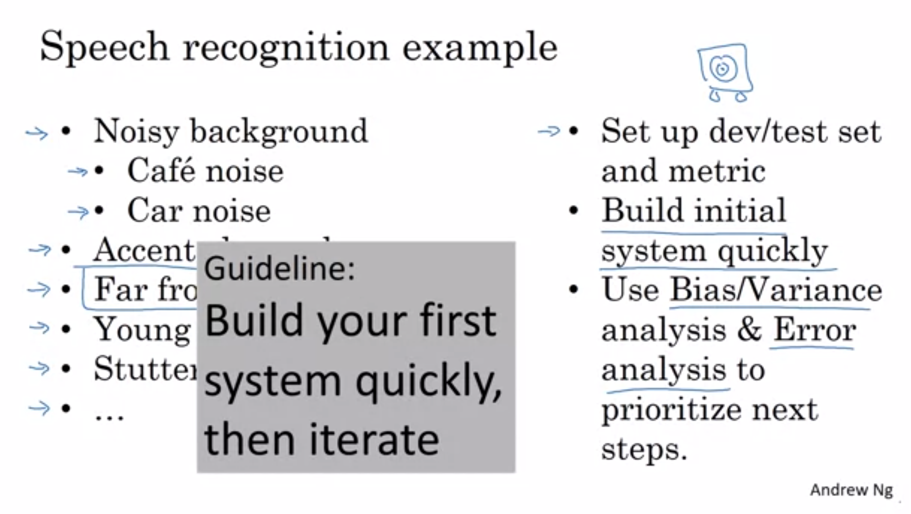

### Training and testing on different distributions

Allowing your training set data to come from a different distribution than your dev and test set allows you to have much more training data. And in these examples, it will cause your learning algorithm to perform better.

### Bias and Variance with mismatched data distributions

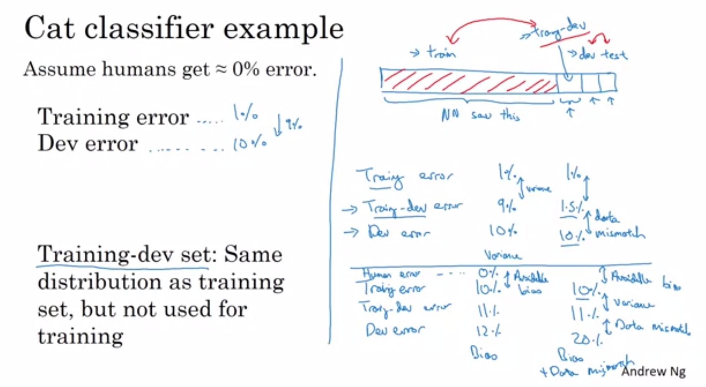

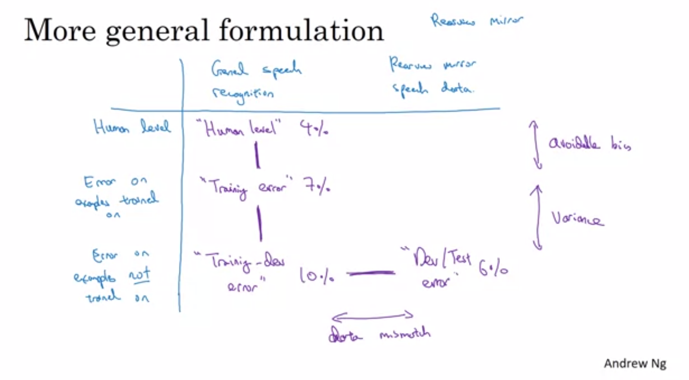

### Addressing data mismatch

"If you think you have a data mismatch problem, I recommend you do error analysis, or look at the training set, or look at the dev set to try this figure out, to try to gain insight into how these two distributions of data might differ. And then see if you can find some ways to get more training data that looks a bit more like your dev set. One of the ways we talked about is artificial data synthesis. And artificial data synthesis does work. In speech recognition, I've seen artificial data synthesis significantly boost the performance of what were already very good speech recognition system. So, it can work very well. But, if you're using artificial data synthesis, just be cautious and bear in mind whether or not you might be accidentally simulating data only from a tiny subset of the space of all possible examples."

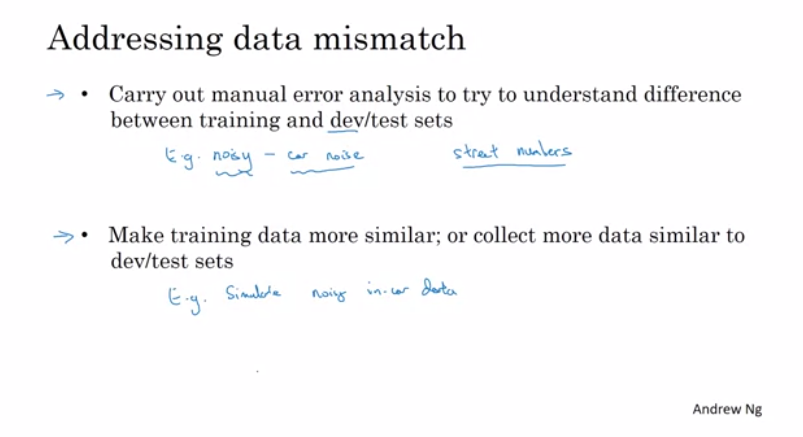

### Transfer Learning

Transfer learning makes sense when you have a lot of data for the problem you're transferring from and usually relatively less data for the problem you're transferring to. 

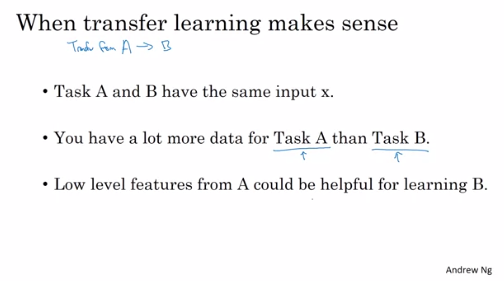

The rule of thumb is maybe if you have a small data set, then just retrain the one last layer at the output layer, or maybe that last one or two layers. But if you have a lot of data, then maybe you can retrain all the parameters in the network. And if you retrain all the parameters in the neural network, then this initial phase of training on image recognition is sometimes called pre-training, because you're using image recognitions data to pre-initialize or really pre-train the weights of the neural network. And if you are updating all the weights afterwards, then training on the data sometimes, that's called fine tuning.

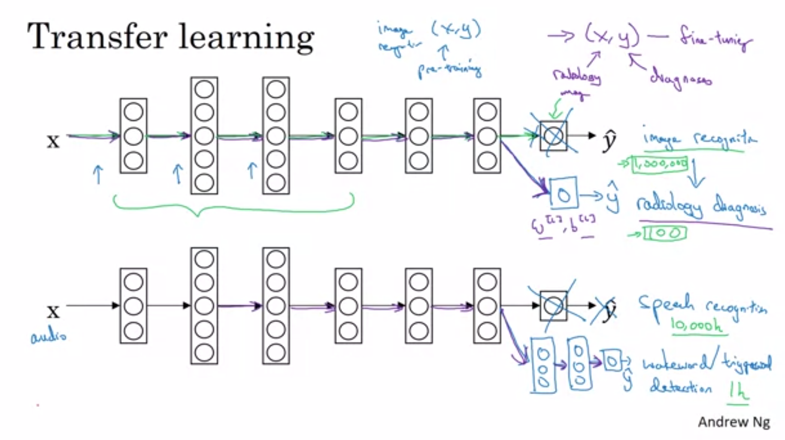

### Multitask Learning

One example is Object Detection - where one neural network trying to detect a whole bunch of objects at the same time. 

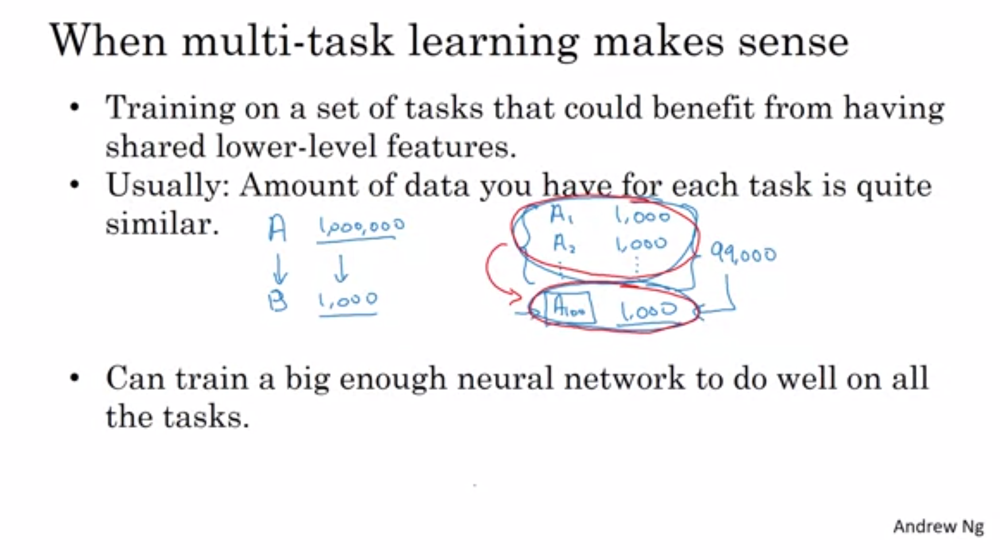

### End to end deep learning

There have been some data processing systems, or learning systems that require multiple stages of processing. And what end-to-end deep learning does, is it can take all those multiple stages, and replace it usually with just a single neural network.

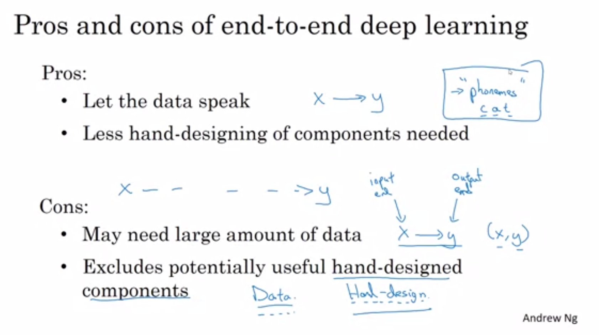

### When to use end-to-end deep learning

"If you're building a new machine learning system and you're trying to decide whether or not to use end-to-end deep learning, I think the key question is, do you have sufficient data to learn the function of the complexity needed to map from X to Y?"