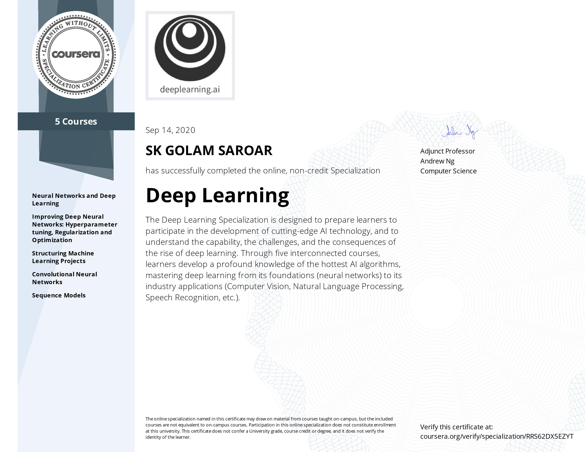

### Deep Learning Specialization on Coursera

This repository contains notebooks from the [Coursera](https://www.coursera.org/) specialization [Deep Learning](https://www.coursera.org/specializations/deep-learning).

There are five courses in the Specialization.

1. **Neural Networks and Deep Learning**: Learn the foundations of deep learning.
- Understand the major technology trends driving Deep Learning
- Be able to build, train and apply fully connected deep neural networks
- Know how to implement efficient (vectorized) neural networks
- Understand the key parameters in a neural network's architecture.

2. **Improving Deep Neural Networks: Hyperparameter tuning, Regularization and Optimization**: Learn the magic of getting deep learning to work well.  
- Understand industry best-practices for building deep learning applications. 
- Be able to effectively use the common neural network "tricks", including initialization, L2 and dropout regularization, Batch normalization, gradient checking, 
- Be able to implement and apply a variety of optimization algorithms, such as mini-batch gradient descent, Momentum, RMSprop and Adam, and check for their convergence. 
- Understand new best-practices for the deep learning era of how to set up train/dev/test sets and analyze bias/variance
- Be able to implement a neural network in TensorFlow. 

3. **Structuring Machine Learning Projects**: Learn how to build a successful machine learning project.  
- Understand how to diagnose errors in a machine learning system, and 
- Be able to prioritize the most promising directions for reducing error
- Understand complex ML settings, such as mismatched training/test sets, and comparing to and/or surpassing human-level performance
- Know how to apply end-to-end learning, transfer learning, and multi-task learning

4. **Convolutional Neural Networks**: Learn how to build convolutional neural networks and apply it to image data.  
- Understand how to build a convolutional neural network, including recent variations such as residual networks.
- Know how to apply convolutional networks to visual detection and recognition tasks.
- Know to use neural style transfer to generate art.
- Be able to apply these algorithms to a variety of image, video, and other 2D or 3D data.

5. **Sequence Models**: Learn how to build models for natural language, audio, and other sequence data.  
- Understand how to build and train Recurrent Neural Networks (RNNs), and commonly-used variants such as GRUs and LSTMs.
- Be able to apply sequence models to natural language problems, including text synthesis. 
- Be able to apply sequence models to audio applications, including speech recognition and music synthesis.

This is my Specialization Certificate:

This is the specialization description on Coursera website:

<blockquote>
    If you want to break into AI, this Specialization will help you do so. Deep Learning is one of the most highly sought after skills in tech. We will help you become good at Deep Learning.  In five courses, you will learn the foundations of Deep Learning, understand how to build neural networks, and learn how to lead successful machine learning projects. You will learn about Convolutional networks, RNNs, LSTM, Adam, Dropout, BatchNorm, Xavier/He initialization, and more. You will work on case studies from healthcare, autonomous driving, sign language reading, music generation, and natural language processing. You will master not only the theory, but also see how it is applied in industry. You will practice all these ideas in Python and in TensorFlow, which we will teach.  You will also hear from many top leaders in Deep Learning, who will share with you their personal stories and give you career advice.  AI is transforming multiple industries. After finishing this specialization, you will likely find creative ways to apply it to your work.  We will help you master Deep Learning, understand how to apply it, and build a career in AI.
</blockquote>
